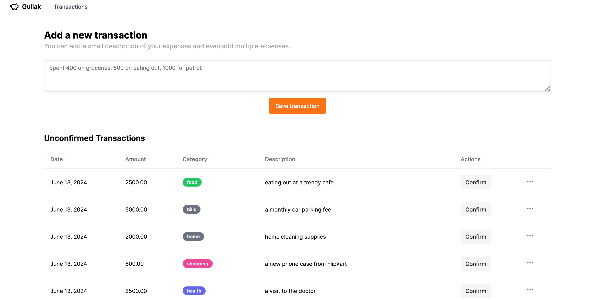

# Gullak - Expense Tracking App

_A no-frills expense tracker app enabling quick logging of expenses in natural language, using LLMs for parsing and categorization._


Gullak is an expense tracker designed to make expense management as intuitive and effortless as possible. Input your expenses in natural language, and let the integrated AI handle categorization and analysis. With Gullak, you can easily view reports and logs of your historical transactions, providing you with daily and monthly summaries to better understand your spending habits.

## Why Gullak?

I originally developed Gullak for personal use. I had a habit of recording my expenses on Apple Notes — a quick and simple method that just got the job done. However, I needed a tool that could not only store these entries but also parse and visualize them effectively. While Gullak was created out of my own necessity, I decided to open source it to help others who might be seeking similar solutions.

## Features

- **Natural Language Input**: Simply type your expenses as you would in a notebook or notes app.
- **Automatic Categorization**: Utilizes AI to categorize expenses based on the input text.
- **Visual Reports**: Generates visual summaries of expenses, providing insights into spending patterns over time.
- **Historical Data**: Access and review past entries with detailed logs and reports.

## Screenshots




## Self Hosting

To self host Gullak yourself, you can use the provided Docker image. Here are the steps to get it up and running:

```bash
docker run --name gullak-app -v gullak-data:/app/expenses.db -p 3333:3333 -d ghcr.io/mr-karan/gullak:latest
```

This setup will expose Gullak on port 3333, storing the SQLite database at the specified volume location.

## Apple Shortcut Integration

[Download Shortcut](https://www.icloud.com/shortcuts/f9039ea721ca4cdeac31fb9b7983450a)

Gullak supports integration with Apple Shortcuts, enabling you to log expenses quickly and effortlessly using Siri. This workflow is especially useful for hands-free operation, such as logging expenses on the go.

### Setting Up the Apple Shortcut

Follow these steps to configure it:

### Download the published shortcut:

- Download a copy of the shortcut from [here](https://www.icloud.com/shortcuts/f9039ea721ca4cdeac31fb9b7983450a).
- Add the shortcut to your library in the Shortcuts app on your iOS device.
- Customize the GULLAK_API endpoint.
  - Open the Shortcuts app and find the newly added shortcut.
  - Tap on the shortcut to open the editing interface.
  - Look for the `gullak_api_endpoint` variable within the actions list.
  - Edit the variable to point to your specific Gullak self hosted installation.

- Run the shortcut via Siri:
  - After setting up, invoke Siri and use the shortcut by saying a phrase like "Log expense."
  - Narrate the details of your expense, such as "Spent 150 Rs on groceries."

### Configuration

Gullak allows you to customize various settings through a configuration file in `.toml` format. Please refer to the provided [sample](./config.sample.toml) config file. Below is a description of each section and their respective settings:

| Section | Key      | Default Value            | Description                                                                   |
| ------- | -------- | ------------------------ | ----------------------------------------------------------------------------- |
| app     | debug    | true                     | Enables debug mode for more verbose output.                                   |
|         | currency | "INR"                    | Sets the currency for your expenses.                                          |
|         | db_path  | "./expenses.db"          | The path where the SQLite database is stored.                                 |
| http    | enabled  | true                     | Enables the HTTP server to run.                                               |
|         | address  | ":3333"                  | The address and port on which the server listens.                             |
|         | timeout  | "30s"                    | The timeout duration for HTTP requests.                                       |
| openai  | base_url | "https://api.openai.com" | The base URL for the OpenAI API. Change this if you use a different endpoint. |
|         | token    | "REDACTED"               | Your OpenAI API token for accessing models.                                   |
|         | model    | "gpt-4o"                 | Specifies the OpenAI model used for processing inputs.                        |
|         | timeout  | "10s"                    | The timeout duration for OpenAI API requests.                                 |

### Using Groq with the Llama3 Model

If you prefer to use a different provider like Groq for OpenAI services, you can specify this in the openai section:

```toml
[openai]
base_url = "https://api.groq.com/openai/v1"
model = "llama3-70b-8192"
token = ""
```

### Env Variables

Gullak supports configuration overrides using environment variables. This can be especially useful when deploying to different environments or when you need to secure sensitive data like API tokens. Environment variables must be prefixed with `GULLAK_`.

Here’s an example on how to set the OpenAI token using an environment variable:

```bash
export GULLAK_OPENAI_TOKEN=your_openai_api_token_here
```

## Local Dev Setup

To set up Gullak for development on your local machine, follow these steps:

1. Clone the repository:

```bash
git clone https://github.com/mr-karan/gullak
```

2. Build the UI (a Vue3 app):

```bash
make build-ui
```

3. Compile the Go binary:

```bash
make build
```

4. Start the application:

```bash
make fresh
```

## LICENSE

Gullak is licensed under the [AGPL v3](./LICENSE) license.
