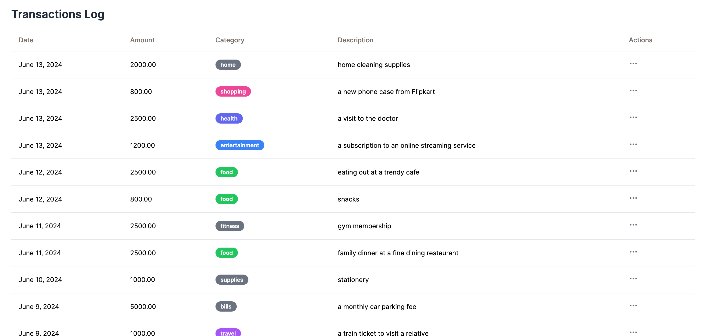

# Gullak - Expense Tracking App

_A minimalist expense tracker enabling quick logging of expenses in natural language, using LLMs for parsing and categorization._



Gullak is a minimalist expense tracker designed to make logging expenses effortless. Input your expenses in natural language, and let the integrated AI handle categorization. Gullak focuses on quick expense logging with the ability to export to CSV for analysis in tools like Actual Budget.

## Why Gullak?

I originally developed Gullak for personal use. I had a habit of recording my expenses on Apple Notes — a quick and simple method that just got the job done. However, I needed a tool that could not only store these entries but also parse and organize them effectively. Gullak is designed as a "log and forget" expense tracker that focuses on making expense logging fast and effortless, then exporting to CSV for analysis in dedicated budgeting tools. While Gullak was created out of my own necessity, I decided to open source it to help others who might be seeking similar solutions.

## Features

- **Natural Language Input**: Simply type your expenses as you would in a notebook or notes app.
- **Smart Categorization**: AI learns from your categories and maintains consistency across transactions.
- **Multi-Currency Support**: Automatically detects currency from context ($, ₹, €, £) - perfect for travel.
- **Quick Confirmation**: Inline checkbox to confirm transactions instantly without modals.
- **Bulk Operations**: Select multiple transactions to edit, confirm, or delete at once.
- **Advanced Filters**: Filter by date ranges, amounts, and categories before export.
- **CSV Export**: Export filtered transactions for analysis in Actual Budget or similar tools.
- **Dense Table UI**: Compact, fast interface focused on efficiency.

## Philosophy

Gullak is designed as a "log and forget" expense tracker. Instead of trying to be an all-in-one budgeting tool with charts and analytics, it focuses on what it does best: making expense logging fast and effortless.

The workflow is simple:

1. **Log** expenses quickly using natural language
2. **Confirm** transactions with a single click
3. **Export** to CSV when ready
4. **Analyze** in dedicated tools like Actual Budget

This keeps Gullak lean, fast, and focused on its core purpose.

## Self Hosting

Gullak is easy to self-host using Docker. Multi-architecture images are available for both `amd64` and `arm64` platforms.

### Using Docker Compose (Recommended)

1. Create a `.env` file with your API keys:

```bash
cp .env.sample .env
# Edit .env and add your OpenAI or Groq API token
```

2. Start Gullak:

```bash
docker-compose up -d
```

3. Access Gullak at `http://localhost:3333`

The database will be persisted in the `./data` directory. You can customize the configuration by editing environment variables in `docker-compose.yml` or by mounting a custom `config.toml` file.

**Production notes:**

- The healthcheck monitors container health by checking the HTTP endpoint every 30 seconds
- Customize the `TZ` environment variable to set your timezone (default: Asia/Kolkata)
- Consider pinning to a specific version tag instead of `latest` for production deployments

### Using Docker CLI

For a quick setup without docker-compose:

```bash
docker run --name gullak \
  -e GULLAK_OPENAI_TOKEN=your-api-key-here \
  -e GULLAK_APP_DB_PATH=/app/data/expenses.db \
  -v gullak-data:/app/data \
  -p 3333:3333 \
  -d ghcr.io/mr-karan/gullak:latest
```

This setup will expose Gullak on port 3333, storing the SQLite database in a named volume.

## Apple Shortcut Integration

[Download Shortcut](https://www.icloud.com/shortcuts/f9039ea721ca4cdeac31fb9b7983450a)

Gullak supports integration with Apple Shortcuts, enabling you to log expenses quickly and effortlessly using Siri. This workflow is especially useful for hands-free operation, such as logging expenses on the go.

### Setting Up the Apple Shortcut

Follow these steps to configure it:

### Download the published shortcut:

- Download a copy of the shortcut from [here](https://www.icloud.com/shortcuts/f9039ea721ca4cdeac31fb9b7983450a).
- Add the shortcut to your library in the Shortcuts app on your iOS device.
- Customize the GULLAK_API endpoint.

  - Open the Shortcuts app and find the newly added shortcut.
  - Tap on the shortcut to open the editing interface.
  - Look for the `gullak_api_endpoint` variable within the actions list.
  - Edit the variable to point to your specific Gullak self hosted installation.

- Run the shortcut via Siri:
  - After setting up, invoke Siri and use the shortcut by saying a phrase like "Log expense."
  - Narrate the details of your expense, such as "Spent 150 Rs on groceries."

### Configuration

Gullak allows you to customize various settings through a configuration file in `.toml` format. Please refer to the provided [sample](./config.sample.toml) config file. Below is a description of each section and their respective settings:

| Section | Key      | Default Value            | Description                                                                   |
| ------- | -------- | ------------------------ | ----------------------------------------------------------------------------- |
| app     | debug    | true                     | Enables debug mode for more verbose output.                                   |
|         | currency | "INR"                    | Sets the currency for your expenses.                                          |
|         | db_path  | "./expenses.db"          | The path where the SQLite database is stored.                                 |
| http    | enabled  | true                     | Enables the HTTP server to run.                                               |
|         | address  | ":3333"                  | The address and port on which the server listens.                             |
|         | timeout  | "30s"                    | The timeout duration for HTTP requests.                                       |
| openai  | base_url | "https://api.openai.com/v1" | The base URL for the OpenAI API. Change this if you use a different endpoint. |
|         | token    | "REDACTED"               | Your OpenAI API token for accessing models.                                   |
|         | model    | "gpt-4o"                 | Specifies the OpenAI model used for processing inputs.                        |
|         | timeout  | "10s"                    | The timeout duration for OpenAI API requests.                                 |

### Using Groq with the Llama3 Model

If you prefer to use a different provider like Groq for OpenAI services, you can specify this in the openai section:

```toml
[openai]
base_url = "https://api.groq.com/openai/v1"
model = "llama3-70b-8192"
token = ""
```

### Environment Variables

Gullak supports configuration overrides using environment variables. This is the recommended approach for Docker deployments to keep sensitive data like API tokens secure. All environment variables must be prefixed with `GULLAK_`.

Common environment variables (see `docker-compose.yml` for complete list):

```bash
# Required: LLM API Configuration
GULLAK_OPENAI_TOKEN=your_api_token_here
GULLAK_OPENAI_MODEL=gpt-4o-mini
GULLAK_OPENAI_BASE_URL=https://api.openai.com/v1

# Optional: App Settings
GULLAK_APP_CURRENCY=INR
GULLAK_APP_DB_PATH=/app/data/expenses.db
GULLAK_APP_DEBUG=false
```

You can also override any config.toml setting using environment variables with the pattern `GULLAK_<SECTION>_<KEY>`. For example, `http.timeout` becomes `GULLAK_HTTP_TIMEOUT`.

## Local Dev Setup

To set up Gullak for development on your local machine, follow these steps:

1. Clone the repository:

```bash
git clone https://github.com/mr-karan/gullak
```

2. Build the UI (a Vue3 app):

```bash
make build-ui
```

3. Compile the Go binary:

```bash
make build
```

4. Start the application:

```bash
make fresh
```

## LICENSE

Gullak is licensed under the [AGPL v3](./LICENSE) license.
