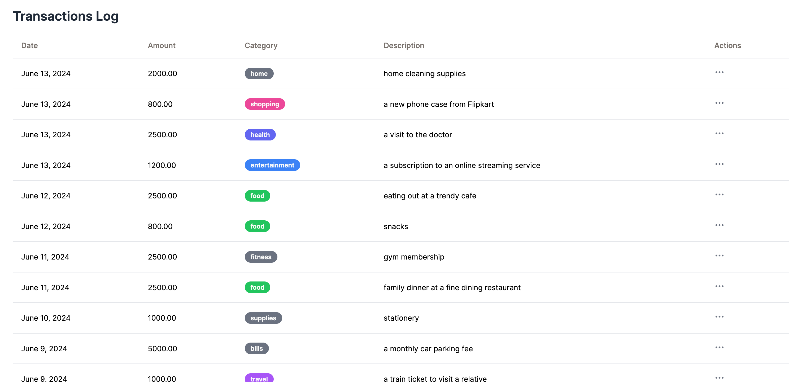

<p align="center">
  
</p>

<h1 align="center">Gullak</h1>

<p align="center">
  <em>Log and forget. AI-powered natural language expense tracking with plain-text accounting.</em>
</p>

<p align="center">
  <a href="#features">Features</a> •
  <a href="#quick-start">Quick Start</a> •
  <a href="#configuration">Configuration</a> •
  <a href="#whatsapp-setup">WhatsApp</a> •
  <a href="#local-development">Development</a>
</p>

---



Gullak is a minimalist expense tracker that turns natural language sentences into structured ledger entries. It combines the ease of a chat interface with the structure of plain-text accounting.

## Why Gullak?

Traditional budgeting apps are tedious. You have to open the app, navigate to "Add Transaction," select a category, pick a date, and type the amount. Gullak simplifies this to a single sentence: _"Spent 150 on coffee at Starbucks using HDFC card."_

Gullak uses LLMs to parse your intent, categorize the expense, and write it to a human-readable `.ledger` file. It's designed for speed, privacy (your data stays in text files), and flexibility.

## Features

- 🧠 **Natural Language Processing**: Type (or speak) your expenses naturally. Powered by LiteLLM.
- 📝 **Plain-Text Accounting**: Uses `ledger-cli` format. Your data is yours, stored in human-readable text files.
- 🤖 **Multi-Provider LLM Support**: Works with OpenRouter (recommended), OpenAI, Anthropic, Gemini, or local Ollama.
- 📊 **Paisa Integration**: Built-in integration with [Paisa](https://paisa.fyi) for detailed charts and financial reports.
- 📱 **WhatsApp Integration**: Log expenses by messaging yourself on WhatsApp via a built-in bridge.
- 💬 **Threaded Conversations**: Context-aware chat history allows for natural follow-up corrections.
- 📸 **Receipt OCR**: Upload receipt images or PDFs via Web UI or WhatsApp. Gullak extracts expense details automatically.
- 🔍 **Transaction Previews**: Review and edit AI-parsed transactions before they are committed to your ledger.
- 🐳 **Docker First**: One-command deployment with Docker Compose.

## Architecture

Gullak runs as a stack of three lightweight services:

1.  **Gullak (FastAPI)**: The main engine handling the AI agent, web UI, and ledger management.
2.  **Paisa**: A visualization engine that reads your ledger files and provides a dashboard.
3.  **WhatsApp Bridge (Node.js)**: A Baileys-based bridge that connects Gullak to your WhatsApp account.

## Quick Start

The recommended way to run Gullak is using Docker Compose.

1.  **Clone the repository**:
    ```bash
    git clone https://github.com/mr-karan/gullak.git
    cd gullak
    ```

2.  **Configure Environment**:
    ```bash
    cp .env.example .env
    # Edit .env and add your API keys (e.g., OPENROUTER_API_KEY)
    ```

3.  **Start Services**:
    ```bash
    docker compose up -d
    ```

4.  **Setup**:
    - Access the UI at `http://localhost:8000`.
    - Follow the **Setup Wizard** to configure your currency, bank accounts, and categories.
    - Start logging!

## Configuration

Gullak is configured via environment variables. The most important ones are:

| Variable | Description | Default |
|----------|-------------|---------|
| `GULLAK_INFERENCE_MODEL` | LiteLLM model string (e.g., `openrouter/google/gemini-2.0-flash-001`) | `openrouter/google/gemini-2.0-flash-001` |
| `GULLAK_INFERENCE_VISION_MODEL` | Model for receipt OCR (optional, falls back to main model) | - |
| `OPENROUTER_API_KEY` | API key if using OpenRouter | - |
| `GULLAK_DEFAULT_CURRENCY` | Your primary currency (e.g., `INR`, `USD`) | `INR` |
| `GULLAK_TIMEZONE` | Your timezone | `Asia/Kolkata` |
| `GULLAK_DATA_DIR` | Directory to store ledger and history | `/data` |

See [.env.example](.env.example) for a full list of configuration options.

## WhatsApp Setup

Gullak includes a WhatsApp bridge that lets you log expenses on the go.

1.  Open the Gullak UI and go to **Settings > WhatsApp Integration**.
2.  Click **Start Session** and scan the QR code with your WhatsApp.
3.  **Security**: It is highly recommended to set `GULLAK_WHATSAPP_ALLOWED_NUMBERS` in your `.env` to restrict who can message the bot.
    ```bash
    GULLAK_WHATSAPP_ALLOWED_NUMBERS='["919876543210"]'
    ```
4.  Send a message like `"Lunch 500"` to the linked number to log your first expense.

## Local Development

Gullak uses [uv](https://github.com/astral-sh/uv) for Python dependency management and [Just](https://github.com/casey/just) as a command runner.

**Prerequisites**:
- Python 3.13+
- [uv](https://github.com/astral-sh/uv)
- [Just](https://github.com/casey/just)
- [ledger-cli](https://ledger-cli.org/)

**Setup**:
```bash
# Install dependencies
just install

# Run development server
just dev
```

Check the `Justfile` for more commands like `test`, `lint`, and `fmt`.

## License

Gullak is licensed under the [AGPL v3](./LICENSE) license.
